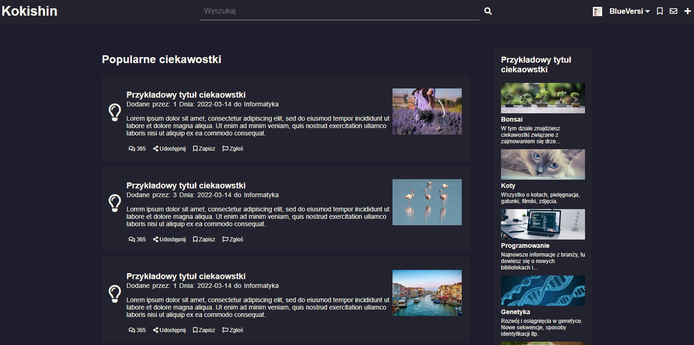
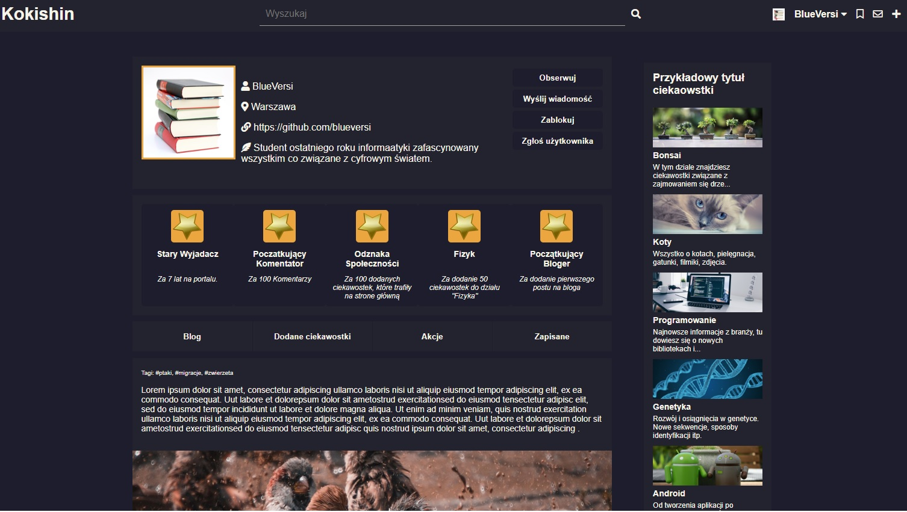

# Kokishin - Social web app for sharing interesting things found in the internet

Work in progress. Readme will be updated.

After download you need to open two shells and in both run:

### `npm start`

## Tech stack

MERN - MongoDb, Express, React, Node js

## Frontend

Frontend server runs on
[http://localhost:3000/]

### Profile Page

## Backend

Backend servers with API runs on
[http://localhost:5000/]
